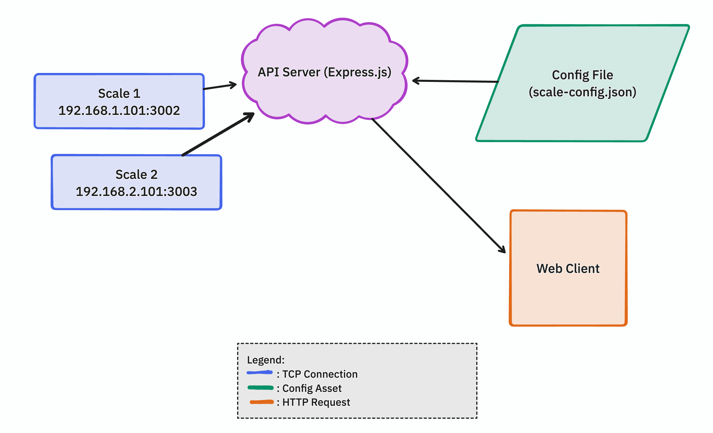

# Scale Monitoring System

A real-time scale monitoring system built with Node.js that allows you to collect weight data from multiple scales through TCP connections and expose them via a REST API.



## 🌟 Features

- 📡 Real-time TCP connection to multiple scales
- 🔌 Dynamic scale configuration via JSON file
- 🚀 RESTful API endpoints
- ♻️ Auto-reconnection mechanism
- 🔍 Built-in scale simulator for testing
- ⚡ Lightweight and efficient
- 📝 Simple JSON-based configuration
- 🔄 Real-time weight updates

## 🛠 Technology Stack

- Node.js
- Express.js
- TCP/IP Sockets
- JSON for Configuration

## 📋 Prerequisites

- Node.js (v12 or higher)
- npm (Node Package Manager)

## 🚀 Installation

1. Clone the repository:
```bash
git clone https://github.com/BintangDiLangit/scale_monitoring_service.git
cd scale_monitoring_service
```

2. Install dependencies:
```bash
npm install
```

3. Create configuration file:
```bash
# scale-config.json will be auto-created on first run
```

## 🏃‍♂️ Running the Application

### Start the Scale Simulator (for testing)
```bash
node scale-simulator.js
```

### Start the API Server
```bash
node scale-api.js
```

## 🔧 Configuration

Scale configurations are stored in `scale-config.json`:

```json
{
  "SCALE_01": {
    "ip": "192.168.1.101",
    "port": 3002,
    "description": "Truck Scale 1"
  },
  "SCALE_02": {
    "ip": "192.168.1.102",
    "port": 3002,
    "description": "Truck Scale 2"
  }
}
```

## 📡 API Endpoints

### Add/Update Scale Configuration
```http
POST /api/scales
Content-Type: application/json

{
    "name": "SCALE_01",
    "ip": "192.168.1.101",
    "port": 3002,
    "description": "Truck Scale 1"
}
```

### Get All Scale Configurations
```http
GET /api/scales
```

### Get Weight from Specific Scale
```http
GET /api/weight/:scaleName
```

### Delete Scale Configuration
```http
DELETE /api/scales/:scaleName
```

## 📊 Example Responses

### Weight Data Response
```json
{
    "name": "SCALE_01",
    "weight": 1234,
    "timestamp": "2024-11-04T12:34:56.789Z",
    "unit": "kg"
}
```

### Scale Configuration Response
```json
{
    "SCALE_01": {
        "ip": "192.168.1.101",
        "port": 3002,
        "description": "Truck Scale 1",
        "updatedAt": "2024-11-04T12:00:00.000Z"
    }
}
```

## 🧪 Testing

For testing purposes, you can use the included scale simulator:

1. Start the simulator:
```bash
node scale-simulator.js
```

2. The simulator will create virtual scales on ports:
   - SCALE_01: localhost:3002
   - SCALE_02: localhost:3003
   - SCALE_03: localhost:3004

## 📁 Project Structure

```
scale-monitoring-system/
├── scale-api.js          # Main API server
├── scale-monitor.js      # Scale monitoring module
├── scale-simulator.js    # Testing simulator
├── scale-config.json     # Scale configurations
├── package.json         
└── README.md
```

## 🔧 Technical Details

### TCP Connection Protocol

The system expects scales to:
1. Accept TCP connections
2. Respond to empty requests with weight data
3. Format: `ST,GS,+,0001234kg` or containing marker "99" followed by weight

### Error Handling

- Auto-reconnection for lost connections
- 5-second timeout for weight readings
- Invalid data format handling
- Connection error recovery

### Performance

- Non-blocking I/O operations
- Efficient event-driven architecture
- Minimal memory footprint
- Fast response times

## 🤝 Contributing

1. Fork the repository
2. Create your feature branch (`git checkout -b feature/AmazingFeature`)
3. Commit your changes (`git commit -m 'Add some AmazingFeature'`)
4. Push to the branch (`git push origin feature/AmazingFeature`)
5. Open a Pull Request

## 📝 License

This project is licensed under the MIT License - see the [LICENSE](LICENSE) file for details.

## 👥 Authors

- Bintang Miftaqul Huda - Initial work - [BintangDiLangit](https://github.com/BintangDiLangit)

## 🙏 Acknowledgments

- Special thanks to anyone who contributed
- Inspired by industrial weighing systems
- Built for real-world applications

## 📞 Support

For support, please open an issue in the GitHub repository or contact the maintainers.

---
Made with ❤️ for the industrial weighing community.
